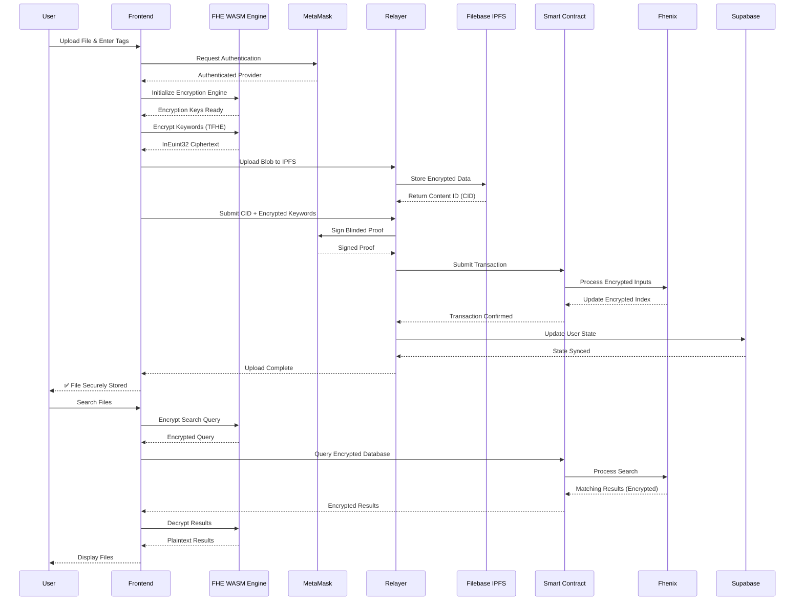

# 🔒 SecureVault

## Privacy-First Cloud Storage via Client-Side FHE & Decoupled Blockchain Indexing

[](https://fhenix.io/)
[](https://sepolia.etherscan.io/)
[](LICENSE)
[](http://makeapullrequest.com)
[](https://reactjs.org/)

> | *Zero-Knowledge Cloud Gateway for Complete Metadata Privacy*

---

## 📋 Table of Contents

- [Overview](#-overview)
- [Problem Statement](#-problem-statement)
- [How It Works](#-how-it-works)
- [Smart Contract](#-smart-contract)
- [Quick Start](#-quick-start)
  - [Prerequisites](#prerequisites)
  - [Installation](#installation)
  - [Environment Configuration](#environment-configuration)
  - [Running the Application](#running-the-application)
- [Contributing](#-contributing)

---

## 🔍 Overview

**SecureVault** is a revolutionary decentralized cloud storage platform that eliminates metadata exposure—a critical vulnerability in existing blockchain storage solutions. By leveraging **Client-Side Fully Homomorphic Encryption (FHE)** and a **Decoupled Blockchain Indexing** architecture, SecureVault ensures that **no plaintext metadata** ever leaves the user's device.

### ✨ Key Features

| Feature | Description |
|---------|-------------|
| 🛡️ **Complete Metadata Privacy** | File tags, names, and lookup data remain encrypted at all times |
| 🔐 **Client-Side FHE** | All encryption happens locally in the browser via WASM |
| ⛓️ **Decoupled Architecture** | Smart contract indexing with blinded cryptographic proofs |
| 🚀 **Seamless UX** | Real-time state management with dynamic user preferences |
| 📦 **Immutable Storage** | File payloads secured on IPFS with content-addressed retrieval |
| ⚡ **Zero-Knowledge Search** | Query encrypted indices without revealing search terms |
| 🎯 **Blinded Proofs** | Cryptographic proofs signed via MetaMask for authenticity |
| 🔄 **Real-Time Sync** | Supabase-powered real-time state management |

---

## ❗ Problem Statement

Most decentralized storage protocols protect file payloads but **expose search metadata** (filenames, classifications, tags). This creates a massive vector for:

```
┌─────────────────────────────────────────────────────────────┐
│                    EXPOSED METADATA                         │
├─────────────────────────────────────────────────────────────┤
│                                                             │
│  🔍 Transaction Tracing     │  📊 Information Leakage      │
│  ───────────────────────    │  ─────────────────────        │
│  • Trace file interactions  │  • Data patterns reveal       │
│  • Monitor user activity    │    sensitive information      │
│  • Pattern analysis         │  • Correlation attacks        │
│                                                             │
│  👤 Privacy Violation        │  🔗 Correlation Attacks     │
│  ─────────────────────      │  ─────────────────────        │
│  • Identity exposure        │  • Link identities to         │
│  • Behavioral profiling     │    stored content             │
│  • Metadata exploitation    │  • Cross-platform tracking    │
│                                                             │
└─────────────────────────────────────────────────────────────┘
```

**The Impact:**
- Anyone can trace your file interactions
- Data patterns reveal sensitive information
- User privacy is compromised at the metadata layer
- Correlation attacks link identities to stored content


---

## 🔧 How It Works

### 1. Asynchronous Key Handshake
The frontend establishes an authenticated provider channel via **MetaMask**, while the `@cofhe/sdk` triggers a localized WASM compilation engine to safely fetch network encryption keys. This ensures that encryption keys are never exposed to the network or any third-party services.

### 2. Client-Side TFHE Operations
File keywords are mapped to deterministic structures (`Encryptable.uint32`) and completely **blinded locally** on the user's machine. The resulting ciphertext payloads conform to the **Fhenix Coprocessor InEuint32** data format, ensuring compatibility with the on-chain processing layer.

### 3. Decoupled Relayer Pipeline
Blinded cryptographic proofs are signed via **MetaMask** and pushed through an **Express relayer node**. The raw payload is offloaded to **Filebase IPFS**, while the generated Content Identifier (CID) and encrypted keyword strings are structurally bound together for on-chain storage.

### 4. Confidential On-Chain Indexing
The compiled data is submitted to the smart contract on **Ethereum Sepolia Testnet**. The contract consumes the raw input, passing encrypted inputs through to the **Fhenix Coprocessor** to build an immutable, searchable database index—**without ever exposing plaintext tags to the mempool or network validators**.

### 5. Real-Time State Management
User context preferences are dynamically maintained via a **real-time Supabase engine**, blending seamless UX with mathematical zero-trust privacy.

---

## 🛠️ Tech Stack

| Layer | Technologies | Version |
|-------|-------------|---------|
| **Frontend** | React, Tailwind CSS, Framer Motion, @cofhe/sdk | React 18, Tailwind 3 |
| **Backend** | Node.js, Express, Ethers.js | Node 16+, Express 4.18 |
| **Storage** | Filebase (IPFS) | IPFS Cluster |
| **Database** | Supabase (PostgreSQL) | Postgres 15 |
| **Blockchain** | Fhenix CoFHE (Sepolia Testnet) | CoFHE SDK |
| **Cryptography** | TFHE (Fully Homomorphic Encryption), WASM | TFHE-rs |
| **Authentication** | MetaMask (Ethereum) | MetaMask SDK |
| **DevOps** | npm, Git, Docker (optional) | - |

---

## 📜 Smart Contract

### Contract Details

**Network:** Ethereum Sepolia Testnet  
**Contract Address:** `0xd8B2F0c91855e78c0F8D2674d1842b167D3c5AB5`  
**Standard:** Custom FHE-Integrated Smart Contract  
**Language:** Solidity (with Fhenix CoPHE integration)

[🔗 View on Etherscan](https://sepolia.etherscan.io/address/0xd8B2F0c91855e78c0F8D2674d1842b167D3c5AB5)

### Contract Features

```
┌─────────────────────────────────────────────────────────┐
│              SMART CONTRACT FEATURES                    │
├─────────────────────────────────────────────────────────┤
│                                                         │
│  ✅ Immutable encrypted database indexing              │
│  ✅ Fhenix Coprocessor integration                     │
│  ✅ Zero-knowledge storage operations                  │
│  ✅ Secure encrypted search metadata                  │
│  ✅ Mempool privacy protection                        │
│  ✅ Blinded proof verification                        │
│  ✅ Content ID (CID) mapping                          │
│  ✅ Encrypted keyword indexing                        │
│                                                         │
└─────────────────────────────────────────────────────────┘
```

### Contract Functions

| Function | Description | Parameters |
|----------|-------------|------------|
| `storeData` | Store encrypted metadata | `bytes memory encryptedKeywords, string memory cid` |
| `searchData` | Search encrypted database | `bytes memory encryptedQuery` |
| `getUserFiles` | Retrieve user's encrypted files | `address userAddress` |
| `verifyProof` | Verify blinded cryptographic proof | `bytes memory proof` |

---

## 🚀 Quick Start

### Prerequisites

Before you begin, ensure you have the following installed:

```
📦 Node.js (v16 or higher)
📦 npm (v8 or higher) or yarn
🦊 MetaMask browser extension
🔗 Git
💳 Sepolia Testnet ETH (for gas fees)
```

### Installation

#### 1. Clone the Repository
```bash
git clone https://github.com/ITSMEHEMANSHU/SecureVault.git
cd SecureVault
```

#### 2. Install Backend Dependencies
```bash
cd backend
npm install
```

The backend dependencies include:
- Express.js - Web framework
- Ethers.js - Blockchain interaction
- @fhenix/sdk - FHE operations
- CORS - Cross-origin resource sharing
- Dotenv - Environment variable management

#### 3. Install Frontend Dependencies
```bash
cd ..
npm install
```

The frontend dependencies include:
- React.js - UI framework
- Tailwind CSS - Styling
- Framer Motion - Animations
- @cofhe/sdk - Client-side FHE
- Ethers.js - Wallet interaction
- React Router DOM - Navigation

### Environment Configuration

#### Backend Configuration (.env)
Create a `.env` file in the `backend` directory:

```env
# Server Configuration
PORT=5000
NODE_ENV=development

# Supabase Configuration
SUPABASE_URL=https://your-project.supabase.co
SUPABASE_KEY=your-supabase-service-role-key

# Blockchain Configuration
PRIVATE_KEY=your-wallet-private-key
CONTRACT_ADDRESS=0xd8B2F0c91855e78c0F8D2674d1842b167D3c5AB5
SEPOLIA_RPC_URL=https://sepolia.infura.io/v3/your-project-id

# IPFS Configuration
IPFS_ENDPOINT=https://api.filebase.io/v1
IPFS_KEY=your-filebase-key
IPFS_SECRET=your-filebase-secret

# CORS Configuration
CORS_ORIGIN=http://localhost:5173
```

#### Frontend Configuration (.env)
Create a `.env` file in the root directory:

```env
# Blockchain Configuration
VITE_CONTRACT_ADDRESS=0xd8B2F0c91855e78c0F8D2674d1842b167D3c5AB5
VITE_SEPOLIA_RPC_URL=https://sepolia.infura.io/v3/your-project-id

# Supabase Configuration
VITE_SUPABASE_URL=https://your-project.supabase.co
VITE_SUPABASE_ANON_KEY=your-supabase-anon-key

# Backend Configuration
VITE_BACKEND_URL=http://localhost:5000

# IPFS Configuration
VITE_IPFS_GATEWAY=https://filebase.ipfs.io
```

### Running the Application

#### Start Backend Server
```bash
cd backend
node server.js
# 🚀 Server running on http://localhost:5000
# 🔗 Connected to Sepolia Testnet
# 📊 Supabase connection established
```

#### Start Frontend Development Server
```bash
cd ..
npm run dev
# ⚡ Vite server running on http://localhost:5173
# 📦 Hot module replacement enabled
```

#### Build for Production
```bash
# Build frontend
npm run build

# Start production server
npm run preview
```

---

### Technical Flow Diagram



---

## 🛡️ Security Features

| Security Feature | Implementation Details | Impact |
|------------------|----------------------|--------|
| **Client-Side FHE** | All FHE operations performed locally via WASM engine | Zero data exposure to external servers |
| **Zero Metadata Exposure** | No plaintext tags leave the user's device | Complete privacy of file metadata |
| **Decoupled Architecture** | Blockchain only stores encrypted proofs | Prevents metadata correlation attacks |
| **Mempool Privacy** | Encrypted inputs prevent transaction tracing | No visibility into user actions |
| **Secure Key Handshake** | MetaMask authenticated provider channel | Ensures authentic key exchange |
| **Immutable Storage** | IPFS content-addressed storage | Tamper-proof file storage |
| **Blinded Cryptographic Proofs** | Signed via MetaMask for authenticity | Verifiable without revealing data |
| **Zero-Trust Indexing** | Fhenix Coprocessor maintains encrypted database | No single point of trust |
| **Real-Time State Management** | Supabase with row-level security | User data isolation |
| **JWT Authentication** | Secure session management | Prevents unauthorized access |


---

## 🤝 Contributing

We welcome contributions! Please follow these steps:

1. **Fork** the repository
2. **Create** a feature branch
   ```bash
   git checkout -b feature/amazing-feature
   ```
3. **Commit** your changes
   ```bash
   git commit -m 'Add amazing feature'
   ```
4. **Push** to the branch
   ```bash
   git push origin feature/amazing-feature
   ```
5. **Open** a Pull Request

### Development Guidelines

```bash
# Lint your code
npm run lint

# Fix linting issues
npm run lint:fix

# Run tests
npm run test

# Format code
npm run format
```

---

## ⭐

If you find this project useful, please consider giving it a star ⭐ on GitHub!

[](https://github.com/ITSMEHEMANSHU/SecureVault)


---

**Built with ❤️**

---

*SecureVault - Where Privacy Meets Innovation*
